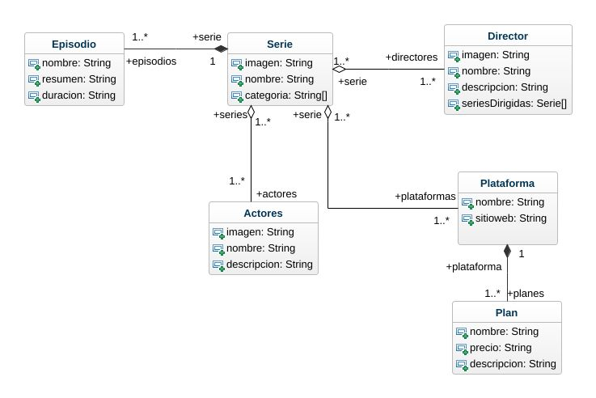

# Proyecto series y peliculas

Resolviendo el siguiente [enunciado](./enunciado.md).

## Contenidos
1. [Repositorio](https://github.com/kashipu/series-peliculas)
2. [Modelo de clases](#modelo-de-clases)


## Modelo de clases


## Glosario de terminos

### Clases
1. Serie
2. Episodio
3. Actores
4. Director
5. Plataforma
6. Plan

## Relaciones
- Ver diagrama
### Métodos
Los metodos que resuelven el enunciado se encuentran en el archivo [main.ts](/src/ts/main.ts)

1. Serie
    - static getAllSeries()
    - static getSerieByIndex(index: number)
    - static getAllCategorias()
    - static createCategoria(categoria: string)
    - setPlataformaByIndex(plataforma: number)
    - setDirectorByIndex(director: number)
    - setActorByIndex(actor: number)
    - setCategoria(nuevaCategoria: string[])
    - get Actores()
    - get Directores()
2. Episodio
    - createEpisodio(nombre: string, resumen: string, duracion: number, serie: Serie)
3. Actor
    - static getAllActores()
4. Director
    - static getAllDirectors()
5. Plataforma
    - static getAllNamePlataformas()
    - static getPlataformaByIndex(index:number)
    - createPlan(nombre: string, precio: number, descripcion: string)
6. Plan


### ¿Cómo iniciar?

1. Clonar el repositorio desde github
2. iniciar npm con el comando
```
npm init
```
3. instalar las dependiencias
```
npm install
```
4. Iniciar la compilación si no existe la carpeta dist
```
npx tsc -w
```
5. abrir el archivo html que se encuenta en la carpeta dist en su navegador

6. Si el archivo del navegador muestra el mensaje "Archivo cargado" abra las herramientas del navegador


